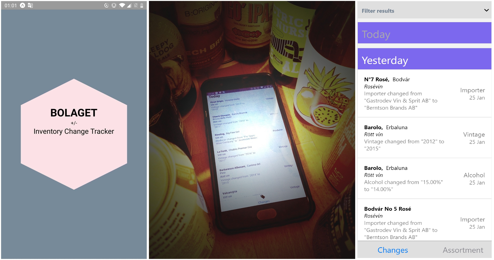

# bolaget-inventory-change-tracker

React Native app displaying changes to the System Bolgat inventory.

Show changes in price, vintage, producer, alcohol content, packaging etc

|||
|-------------|-------------------|
| **Frontend**  |<a href="https://bolaget.netlify.app" target="_blank">bolaget.netlify.app</a>|



The react native app talks to two APIs. The first and main one is the "inventory" api, which sits on top of a large amount of historic Systemet data. The second one, the "redash" api, is a static api which provides access to our Redash graphing platform. The code for the redash api is in this repository.

# Setup

Update your node and npm versions from here [https://nodejs.org/en/download/](https://nodejs.org/en/download/), and get yarn here [https://yarnpkg.com/lang/en/docs/install/#windows-stable](https://yarnpkg.com/lang/en/docs/install/#windows-stable)

```sh
cd app
yarn
yarn run web
```

You need both backends as well. By default (in *appsettings.json*), the app will use a local express server to simulate both.
In the second window, run this:


```sh
cd fakebackend
yarn
yarn run live
```


# (Docker Setup)

```sh
docker-compose up --build
```

And just like that everything will start running. The app will run on http://localhost:19006/. You have hot reloading and can start developing.

However there are a few annoying issues. Firstly, "clear site data" needs to be run before new changes to the app code can be seen in the browser. The developer console (`http://localhost:19002/`) also isn't there. I wouldn't currently recommend developing expo apps from docker. I'd recommend following the non-docker instructions.

# Running on another device #

If you want to run the app using your phone on lan you'll need to also go into *appsettings.json* and change the `baseUrl` from *localhost* to your ip.

# Lint #

```sh
cd app
yarn run lint
```

# Deploy #

Continuous deployment of both the App and the Static API is setup on https://app.netlify.com/.

    App:
     Base directory: app
     Build command: yarn run build-web
     Publish directory: app/web-build

    Static API:
     Publish directory: redash

But are just static files and can go on any CDN. The _header and _redirect configurations for the static API are there to fix CORs issues and would have to be redone in another format for another choice of CDN.
